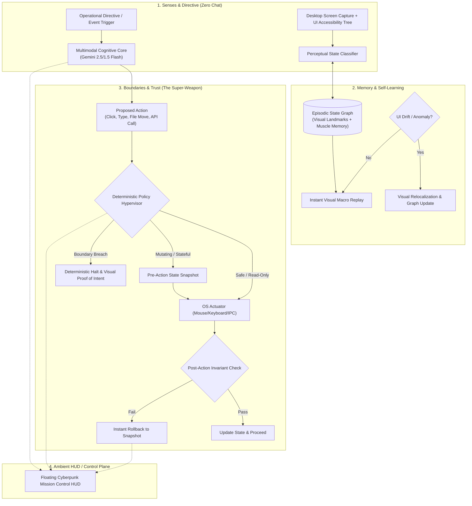

# AegisOS: Autonomous Ambient Operator
*Rescue AI from the chat window. Give it hands, memory, and a sense of boundaries.*

---

## 🏆 The Core Concept & Why This Wins

### The Problem We Are Solving
Every team at this hackathon will build another chatbot wrapper. They will paste an LLM into a chat box, give it basic API tool-calling, and watch it fail uncontrollably the moment it encounters an unexpected state.
Current AI agents suffer from three fatal flaws:
1. **Trapped in chat**: They talk instead of executing.
2. **Amnesiac & brittle**: If a UI changes by 10 pixels or an API breaks, they hallucinate and crash.
3. **Dangerously unconstrained**: They lack deterministic boundaries, meaning nobody can trust them without babysitting every click.

### The Winning Solution: AegisOS
**AegisOS is an autonomous desktop operator that lives in your OS, possessing real-world sensory-motor "hands", self-healing episodic "memory", and a deterministic "blast-radius boundary hypervisor" with automatic rollback.**

It has **no chat box**. You feed it high-level operational directives (or it triggers from events), and it executes tasks directly across legacy desktop software, modern browser apps, and local files while giving you 100% mathematical guarantees that it will never cross your defined boundaries.

---

## 📐 Architecture & The 3 Pillars

---

## 🛠️ The 3 Pillars in Detail

### 1. "Hands" (Sensory-Motor OS Actuation)
* **Screen Perception**: High-speed frame capture (MSS / desktop duplication) coupled with OS Accessibility Trees (`pywinauto` / `UIAutomation` / CDP).
* **Direct Actuation**: Low-level mouse and keyboard event synthesis (`PyAutoGUI` / `pydirectinput`) that works across **any** software—whether it’s a 20-year-old legacy accounting app, SAP, Blender, or a web portal.

### 2. "Memory" (Self-Learning & Muscle Memory)
* **Episodic State Graph**: Stores successful paths as visual-spatial graphs:
  $$\text{State}_t = \langle \text{VisualHash}, \text{Landmarks}, \text{BoundingBox}, \text{Action} \rangle$$
* **Self-Healing Adaptation**: If an app button moves, changes color, or a surprise modal dialog appears:
  1. The agent notices the visual drift from the stored state graph.
  2. It switches to multimodal reasoning to relocalize the semantic target.
  3. It verifies the new interaction and updates the graph edge.
  4. Next time, it executes immediately using the newly learned "muscle memory".

### 3. "Boundaries" (Guardrails & Trust)
* **Deterministic Policy Engine (Not a fuzzy prompt)**:
  * Hard limits (e.g., maximum dollar amounts, protected file extensions, blacklisted URLs/directories).
* **Zero-Regret Snapshot & Rollback**:
  * Before executing any mutating action (e.g., modifying records, deleting files), it takes an atomic snapshot (file copy / memory state / DOM snapshot).
  * If the post-action visual or system invariant check fails, it rolls back automatically within 300ms.
* **Proof-of-Boundary**:
  * When a high-stakes irreversible action is reached, it doesn't crash or ask vague questions. It renders a clean, one-click visual cryptographic verification card on the HUD showing the exact intent and blast radius.

---

## 💻 Recommended Tech Stack (Fast to build, 100% reliable)

| Component | Technology | Why Chosen |
| :--- | :--- | :--- |
| **Backend & Core Agent** | Python 3.11+ / FastAPI | Speed of development, native OS library support. |
| **Vision & Planning** | Gemini 2.5 / 1.5 Flash | Sub-second latency, superior spatial coordinate detection, multimodal tool-calling. |
| **OS Actuation & Vision** | `pywinauto` + `mss` + `PyAutoGUI` + `Pillow` | Flawless cross-window capture, zero complex setup. |
| **Memory Graph** | SQLite + NetworkX / TinyDB | Zero heavy infrastructure, instant local queries, easily serializable for demo visualization. |
| **Boundary Hypervisor** | Pydantic + Custom Invariant Engine | 100% deterministic, zero LLM hallucination in safety checks. |
| **UI / Mission Control HUD** | Lightweight HTML/Tailwind/Webview or Electron / PyQt | Floating ambient HUD with dark mode, real-time thought telemetry, and zero chat window. |

---

## 🎬 The 3-Minute Hackathon Winning Demo Script

Judges evaluate in under 3 minutes. Here is the exact, unshakeable demo script:

### [0:00 - 0:30] The Hook (Punching the Chat Window in the Face)
* *"Judges, we taught rocks to think, and now we use them to ask chatbots to rewrite emails. We're done with chat windows. Meet AegisOS: an autonomous operator with hands, memory, and unbreakable boundaries."*
* Show the screen: There is **no chat box**. Just a clean ambient Mission Control bar docked at the top corner of the screen.

### [0:30 - 1:15] Act I: The Hands
* You trigger a directive: *"Reconcile today's vendor payouts from Excel into this legacy desktop billing application and web ledger."*
* Watch AegisOS take the wheel: mouse moves smoothly, windows focus, data is transcribed across desktop and browser with zero human intervention.

### [1:15 - 2:00] Act II: Memory & Self-Learning (The "Chaos Test")
* Live during the demo, you sabotage the app: you resize the window, switch to dark mode, or swap the order of the columns.
* Conventional bots crash. AegisOS highlights:
  > `[MEMORY DRIFT DETECTED: Button 'Submit' relocated (Δx=+120px)]`
  > `[SELF-HEALING: Visual relocalization successful. Updated Episode #104.]`
* It clicks the new button without missing a beat. The judges see the memory graph node turn green.

### [2:00 - 2:45] Act III: The Boundaries (The Mic-Drop Moment)
* The agent reaches an invoice with a tampered wire amount: **\$45,000** (exceeding the \$5,000 threshold) and a malicious file payload trying to delete system logs.
* Instead of blindly obeying the prompt, the **Boundary Hypervisor** halts actuation at the OS level.
* The HUD pulses red:
  > `[BOUNDARY CONTRACT VIOLATION: Transaction $45,000 exceeds safety ceiling $5,000]`
  > `[ACTION BLOCKED: Rollback snapshot verified. Zero state mutation.]`
* It presents a single-click cryptographic override token. You show that the dangerous action was mathematically impossible for the LLM to trigger on its own.

### [2:45 - 3:00] The Close
* *"AegisOS rescues AI from chat by giving it the hands to work, the memory to adapt, and the boundaries to be trusted in the real world."*

---

## ⏱️ Step-by-Step Hackathon Execution Roadmap (24-48 Hours)

### Phase 1: Foundation & Actuation (~6 Hours)
- [ ] Set up Python environment with screen capture (`mss`), image processing (`Pillow`), and OS input (`PyAutoGUI`).
- [ ] Connect Gemini multimodal API with structured coordinate detection (bounding box / normalized $(x,y)$ clicks).
- [ ] Build basic loop: `Capture Screen` $\to$ `Analyze` $\to$ `Predict Action` $\to$ `Execute`.

### Phase 2: Boundary Hypervisor (~6 Hours)
- [ ] Create deterministic policy rules (`MaxSpendRule`, `ProtectedPathRule`, `SuspiciousActionRule`).
- [ ] Implement pre-action state capture (file backup / directory snapshot).
- [ ] Implement rollback mechanism that restores state if post-action verification fails.

### Phase 3: Episodic Memory & Self-Healing (~6 Hours)
- [ ] Build SQLite-backed state graph (storing task nodes, element visual templates, and relative coordinates).
- [ ] Implement visual drift detection: if element template match score drops below threshold, trigger Gemini visual re-anchor and update coordinate weights.

### Phase 4: Mission Control HUD & Demo Polish (~6 Hours)
- [ ] Build floating overlay UI (showing live task queue, real-time safety invariants, and memory graph visualization).
- [ ] Prepare the demo application sandbox (a mock legacy desktop app or local web app + tampered test files).
- [ ] Rehearse the 3-minute pitch and prepare pre-recorded fallback video clips.

---

## 🛡️ Fail-Safe Strategy (Hackathon Proofing)
1. **Network Lag Defense**: Cache recent frame embeddings so Gemini calls only happen when visual changes occur.
2. **Coordinate Drift Defense**: Normalize screen coordinates to $(0-1000)$ scale to be resolution-independent.
3. **Local Mock Mode**: Have a synthetic offline test suite pre-configured so that even if the venue Wi-Fi drops, the entire demo runs locally on saved traces.

---

## ❓ Open Questions & Next Steps

1. **Host Environment**: Are you developing primarily on **Windows** (which matches your current machine) or macOS/Linux? (Windows is fantastic for this because of rich legacy desktop software examples!)
2. **Demo Target Application**: Would you prefer the demo to run against:
   * A simulated legacy desktop app (e.g. built in Tkinter/PyQt simulating old enterprise ERP/hospital software)?
   * Modern browser apps (e.g. Stripe, Salesforce, Gmail)?
   * Or a hybrid of desktop + browser?
3. **Next Step**: Once you approve, we will initialize the project directory and implement the core Boundary Engine and Actuation loop.
